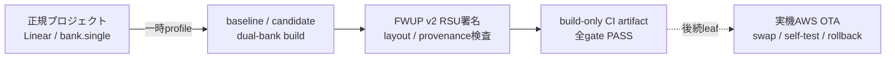

# RX671 / Type 1YN OTA成果物のフラッシュ配置契約



## 1. 目的と適用範囲

本文書は、EK-RX671 / Type 1YN向けsoftware OTAの「署名済み成果物を再現可能に
生成できる」段階について、通常ビルドとの差分、固定フラッシュ配置、CI証跡、
および未証明事項を定義する。

`Projects/aws_wifi_rx671_ek/e2studio_ccrx`の正規プロジェクトは、引き続きLinear
mode / `bank.single`の通常アプリケーションである。OTA用設定をSmart
Configuratorや`.cproject`へ恒久保存しない。OTA成果物生成時だけ
`tools/build_rx671_ota_images.py`がdual-bank profileを一時適用し、処理の成否に
かかわらず対象ファイルをバイト列単位（byte-for-byte）で復元する。

このCI leafは、成果物生成、配置、provenance、署名の整合だけを検証する。
AWS OTAの実機成功を証明しない。したがって、これだけを根拠にREADMEの
「AWS IoT Core 接続テスト結果」を○へ更新しない。

## 2. 通常profileとOTA成果物profile

| 項目 | 正規プロジェクト / 通常ビルド | OTA成果物生成中だけ |
|---|---|---|
| CC-RX device mode | `bank.single` | `bank.dual` |
| BSP bank mode | `BSP_CFG_CODE_FLASH_BANK_MODE=1` | `BSP_CFG_CODE_FLASH_BANK_MODE=0` |
| FWUP area size | `0x00100000`（1 MiB） | `0x000C0000`（768 KiB） |
| アプリ配置 | 従来のLinear配置 | main `0xFFF00000` + `0x300` = `0xFFF00300` |
| WHD firmware / NVRAM / CLM | 従来の固定section | アプリに続く同一main image group |
| RAM初期値section | 従来section | `PFRAM2=RPFRAM2`を追加し、`PFRAM2`をmain image groupへ含める |
| image version | `demo_config.h`既定値 | `APP_VERSION_*`で`0.1.0` / `0.1.1`を明示 |
| runtime | MQTT/Fleet/LANBENCHの通常分岐 | `RX671_OTA_RUNTIME_ENABLE=1`でMQTT Agent + OTA demoを自動起動 |

別途、資格情報投入専用のprovisionerを正規`bank.single`配置で生成する。
`RX671_OTA_PROVISIONER_ENABLE=1`のときはWHD/IPを開始せず、LittleFS/KVS初期化後に
共通CLIをSCI6へ常駐させる。`cert`、`key`、`thingname`、`endpoint`、
`codesigncert`、`codesignpubkey`を`conf set` / `commit`で保存できる。

通常プロジェクトがLinear / `bank.single`であることと、OTA成果物がdual-bank
配置であることは両立させる。前者は開発・ネットワーク試験の既存動作を維持し、
後者はbootloaderが扱う署名対象の固定配置を作る。

## 3. 固定code flash配置

正本は`ota-layout-contract.json`である。RX671の2 MiB code flashを1 MiBずつの
main / buffer bankとして扱い、各bank末尾256 KiBをbootloader予約相当として
除外する。署名・更新対象となるinstall areaは各768 KiBである。

| 範囲 / anchor | 値 | 用途 |
|---|---:|---|
| buffer bank start | `0xFFE00000` | download / swap対象bank |
| main bank start | `0xFFF00000` | 現在実行する論理main bank |
| install area size | `0x000C0000` | header、descriptor、applicationを含む768 KiB |
| FWUP header | main `+0x000`–`+0x1FF` | 512-byte FWUP header |
| FWUP v2 descriptor | main `+0x200`–`+0x2FF` | 256-byte descriptor |
| application start | `0xFFF00300` | main `+0x300` |
| exception vector | `0xFFFBFF80` | install area末尾128-byte window |
| reset vector | `0xFFFBFFFC` | install area末尾 |
| bootloader reserved | `0xFFFC0000`–`0xFFFFFFFF` | RX671専用bootloaderと固定vector |

OTA linker profileでは、アプリ、`TYPE1YN_FW_BLOB`、`TYPE1YN_NVRAM_BLOB`、
`TYPE1YN_CLM_BLOB`を`0xFFF00300`から始まる同一groupに置く。Cコード側は
`g_type1yn_*` linker symbolを参照するため、bank swap後も同じ論理main address
としてWHD資材へ到達できる。`PFRAM2=RPFRAM2`も同じ署名imageに含める。

RX671専用bootloaderの配置は、別projectのMOT/MAPと
`tools/ci/check_rx671_bootloader_layout.py`で確認する。RX72N/RX65Nの予約値は
流用しない。

## 4. Data Flash所有権

RX671の8 KiB Data Flash（`0x00100000`–`0x00101FFF`）はLittleFSの単独所有と
する。

- `RX_BOOTLOADER_INSTALL_DATA_FLASH=0`
- `RX_BOOTLOADER_USE_DATAFLASH_KEY_STORE=0`
- `RX_BOOTLOADER_USE_LITTLEFS_KEY_STORE=1`
- OTA RSUのData Flash start/endは`0xFFFFFFFF`（payloadなし）

FWUP header / descriptorはcode flashに置く。bootloader署名公開鍵はLittleFS
から読み、raw Data Flash install、raw key-store、OTA Data Flash payloadを
使わない。

## 5. 一時profileと復元契約

`tools/build_rx671_ota_images.py`は開始時に次の4ファイルをbytesとして保存する。

1. `.cproject`
2. `src/frtos_config/r_fwup_config.h`
3. `src/smc_gen/r_config/r_bsp_config.h`
4. `src/smc_gen/r_bsp/board/generic_rx671/r_bsp_config_reference.h`

各imageを作る直前に保存値からOTA profileを生成するため、baselineからcandidate
へ設定差分が累積しない。build、署名、解析のいずれかが失敗しても`finally`で
4ファイルを復元し、開始時のGit source stateと終了時のstateが一致しなければ
失敗とする。

正式なprovenanceはclean treeだけを受け付ける。`--allow-dirty`はローカルでの
調査用であり、manifestに`dirty=true`を残すため正式なPASS証跡に採用しない。
formal buildの入力submoduleは、開始時・各build後・終了時にgitlinkとの一致と
worktree cleanを確認し、全gitlink SHAをmanifestへ記録する。
WHD portability patchがgitlinkへ未収録の場合はcleanなWHDへ既知patchだけを一時
適用し、各buildの成否にかかわらず逆適用する。別のsubmodule差分が残れば失敗する。

OTA成果物へ実機ネットワーク秘密を混入させないため、OTA helperは子buildから
`RX671_EK_WIFI_SSID` / `RX671_EK_WIFI_PASSPHRASE` /
`RX671_EK_WIFI_PASSWORD`を除外し、Wi-Fi/AWS local configを明示的に無効化する。
共有Runnerに残ったignored JOIN headerはbuild中に隔離して終了時に削除し、生成した
MOT / ABS / MAP / RSUに設定済みWi-Fi credentialが残っていないことも検査する。

## 6. CI package job

OTA固有ファイルを変更したmerge requestは、一般RX671 network ruleより先に
build-only workflowへ振り分ける。このworkflowでは既存のRX671 Wi-Fi buildと
flash/UART/AWS/network jobを起動せず、次の順で処理する。

1. `build_rx671_bootloader`が専用projectをビルドし、MOT / ABS / MAPを公開する。
2. `package_rx671_ota_artifacts`が`needs`でbootloader成果物を受け取る。
3. Python `cryptography`を導入し、layout、packer、profile、bootloaderのunit
   testsを実行する。
4. baseline `0.1.0`とcandidate `0.1.1`を同じ固定コマンドで生成する。
5. `build/rx671-ota/`をpipeline artifactとして保存する。

```powershell
python tools/build_rx671_ota_images.py `
  --baseline-version 0.1.0 `
  --candidate-version 0.1.1 `
  --e2studio $env:E2STUDIO_CLI `
  --workspace-root $env:E2STUDIO_WORKSPACE_RX671_OTA
```

この既定コマンドは資格情報を含まない正式成果物を生成する。focused実機jobだけは
`--runtime-wifi-config`を追加でき、その場合は
`RX671_EK_WIFI_SSID` / `RX671_EK_WIFI_PASSPHRASE`を一時JOIN headerへ注入する。
manifestは`formal=false` / `credentials_embedded=true`となり、この実機用imageを
CI artifactとして公開してはならない。

`build/rx671-ota/`には少なくとも次を含める。

- `bootloader/`のMOT / ABS / MAP
- `baseline-0.1.0/`と`candidate-0.1.1/`のMOT / ABS / MAP
- 各versionのECDSA P-256署名済みFWUP v2 RSU
- bank.single provisionerのMOT / ABS / MAP
- signer certificateと公開鍵（秘密鍵はartifactへ収録しない）
- candidateの`aws_wifi_rx671_ek.ota.bin`（full RSUの`0x200` byte以降）と、
  同payloadに対応するECDSA DER署名
- OTA適用中のeffective configuration snapshot
- source SHA、submodule gitlink、各入力・出力SHA-256を持つprovenance manifest
- machine-readable layout analysis report

repositoryのsample signing keyは、CIにおける形式・署名自己検証専用である。
製品用秘密鍵の保管、発行、rotationはこのleafの範囲外とする。

## 7. 自動検証の合格条件

`tools/ci/analyze_rx671_ota_layout.py`は、単なるファイル存在確認ではなく、同一
buildのMOT / MAP / RSU / signer certificate / effective config / provenanceを
結び付ける。主な合格条件は次のとおり。

- `.cproject=bank.dual`かつBSP Dual mode
- main/buffer、768 KiB install area、`main+0x300`、vector、bootloader予約の一致
- アプリとWHD 3資材が1個のinstall area内に収まること
- WHD実blob sizeとmanifest SHA-256の一致
- RX671専用bootloader map/MOT、設定、submodule SHAの一致
- Data FlashがLittleFS単独所有で、RSUにData Flash payloadがないこと
- RSU header / descriptor / image versionの一致
- ECDSA P-256 raw signatureのcertificate公開鍵による検証成功
- `source_sha`、`dirty=false`、project path、全必須hashの一致

いずれかが不一致ならpackage jobを失敗させる。古いMOT/MAP、別SHAの成果物、
manifestなしの成果物は正式証跡として扱わない。

## 8. 実機AWS OTAを○にするための残り

このpackage jobはボードを占有せず、次を実行しない。

- bootloaderとbaseline imageの実機flash
- AWS IoT Jobs経由のcandidate RSU配信
- device側の署名受理、download、install、bank swap
- reboot後の`0.1.0`から`0.1.1`へのversion遷移
- self-test成功、commit、失敗時rollback
- AWS Job / Stream / S3 objectの後片付け確認

これらを同一source SHAとpipelineに結び付けて実機確認できた時点で、初めて
「AWS IoT Core 接続テスト結果」のRX671 software OTA欄を○へ変更できる。
