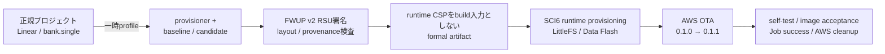

# RX671 / Type 1YN OTA成果物のフラッシュ配置契約



## 1. 目的と適用範囲

本文書は、EK-RX671 / Type 1YN向けsoftware OTAについて、通常ビルドとの差分、
固定フラッシュ配置、runtime CSPをbuild入力としない署名済み成果物、実行時
provisioning、実機AWS OTAのCI証跡、および証明範囲を定義する。

`Projects/aws_wifi_rx671_ek/e2studio_ccrx`の正規プロジェクトは、引き続きLinear
mode / `bank.single`の通常アプリケーションである。OTA用設定をSmart
Configuratorや`.cproject`へ恒久保存しない。OTA成果物生成時だけ
`tools/build_rx671_ota_images.py`がdual-bank profileを一時適用し、処理の成否に
かかわらず対象ファイルをバイト列単位（byte-for-byte）で復元する。

package job単体は実機AWS OTA成功を証明しない。成果物生成、配置、provenance、
署名の整合だけを検証する。
実機AWS OTAの成功は、同一source SHAで実行するfocused hardware pipelineの
provisioning、OTA、cleanup jobを合わせて判定する。

## 2. 通常profileとOTA成果物profile

| 項目 | 正規プロジェクト / 通常ビルド | OTA成果物生成中だけ |
|---|---|---|
| CC-RX device mode | `bank.single` | `bank.dual` |
| BSP bank mode | `BSP_CFG_CODE_FLASH_BANK_MODE=1` | `BSP_CFG_CODE_FLASH_BANK_MODE=0` |
| FWUP area size | `0x00100000`（1 MiB） | `0x000C0000`（768 KiB） |
| アプリ配置 | 従来のLinear配置 | main `0xFFF00000` + `0x300` = `0xFFF00300` |
| WHD firmware / NVRAM / CLM | 従来の固定section | アプリに続く同一main image group |
| RAM初期値section | 従来section | `PFRAM2=RPFRAM2`を追加し、`PFRAM2`をmain image groupへ含める |
| image version | `demo_config.h`既定値 | `APP_VERSION_*`で`0.1.0` / `0.1.1`を明示 |
| runtime | MQTT/Fleet/LANBENCHの通常分岐 | `RX671_OTA_RUNTIME_ENABLE=1`でMQTT Agent + OTA demoを自動起動 |
| OTA download block | library既定値 | `4096` byte（8 KiB MQTT受信bufferにJSON/Base64応答も収容） |
| SDHI run clock | `SDHI_DIV_2`（PCLKB 60 MHz / 2 = 30 MHz） | `SDIO_HOST_CFG_RUN_CLOCK_DIV=SDHI_DIV_8`（7.5 MHz） |

別途、資格情報投入専用のprovisionerを正規`bank.single`配置で生成する。
`RX671_OTA_PROVISIONER_ENABLE=1`のときはWHD/IPを開始せず、LittleFS/KVS初期化後に
共通CLIをSCI6へ常駐させる。`cert`、`key`、`thingname`、`endpoint`、
`codesigncert`、`codesignpubkey`を`conf set` / `commit`で保存できる。Wi-Fiは
`wifissid`と`wifipass`を`conf sethex`で保存し、両方のreadbackを禁止する。

### 空Data Flash初回起動時のlogging境界

空のData Flashは正常な初回起動状態である。`lfs_mount()`はall-`0xFF`のmetadataを
`LFS_ERR_CORRUPT`として返し、LittleFSは`LFS_ERROR("Corrupted dir pair ...")`を
出力する。さらに`conf commit`はdev-mode PKCS #11 helperを通り、その便宜的な
messageは`configPRINTF`を使用する。provisionerではlogging taskを生成せずSCI6を
CLI専用にするため、どちらかが未初期化の`vLoggingPrint()`へ到達すると
`iot_logging_task_dynamic_buffers.c:587`の`configASSERT(xQueue)`で停止する。

そのため一時provisioner profileだけに`LFS_NO_DEBUG`、`LFS_NO_WARN`、
`LFS_NO_ERROR`、`LIBRARY_LOG_LEVEL=LOG_NONE`を追加し、同じ
`RX671_OTA_PROVISIONER_ENABLE=1`でdev-mode key helperの`configPRINTF`も抑止する。
これらはbuild終了時にbyte-for-byteで復元し、正規projectおよび
baseline/candidateのprofileへ残さない。LittleFSのmount失敗→format→remount、
PKCS #11 object生成、LittleFS/KVS commitという処理自体は維持する。

### OTA runtimeのSDIO clock margin境界

正規projectのnetwork / MQTT / LANBENCHは、通信性能を維持するため
`SDHI_DIV_2`（30 MHz）を使い続ける。formal software OTAのbaseline / candidateだけは、
一時`.cproject`へ`SDIO_HOST_CFG_RUN_CLOCK_DIV=SDHI_DIV_8`を追加して7.5 MHzで動作させる。
WHD/IPを開始しないprovisionerにはこのdefineを追加しない。

scheduled pipeline #9666のTLS 1.2 job #61870とTLS 1.3 job #61901では、DIV2のまま
baseline startupを各3回試行した全6回で、WHD firmware load、`whd_wifi_on`、MAC取得までは
成功した後、JOIN中のFunction 2 CMD53 readが同じstatusで停止した。host側の既定2 resetは
毎回Type 1YNをpower-cycleしており、追加delayやretryで成功条件を緩める対象ではない。
一方、同じDIV2のfocused job #61363 / #61398は成功しているため、機能欠落ではなく長い
formal OTA transactionをnightly matrixで反復する際のmargin不足として扱う。

OTA download自体はAWS Jobs / flash処理が支配的であり、normal LANBENCHのSDIO throughput
設定を下げずにOTA profileだけmarginを優先する。package jobはeffective `.cproject`の
dividerを`ota_sdio_run_clock` gateで検査し、provenance manifestにも
`sdio_run_clock_div`を記録する。formal builderは外部のSDIO clock override変数を除去し、
`SDIO_HOST_USE_HIGH_SPEED_CLOCK`によるDIV8迂回もfail-closedで拒否する。
TLS 1.2 / TLS 1.3のfocused実機OTAと、DIV2のnormal
network / MQTT / LANBENCH回帰を同一source SHAで確認して初めて実機成立とする。

### provisioner CLI stack境界

RX671の`configMINIMAL_STACK_SIZE`は140 `StackType_t` wordsである。従来の
`configMINIMAL_STACK_SIZE * 6U`はRX600v2 portでは840 words = 3360 bytesにしか
ならない。一方、device private keyのcommit経路はCC-RXのframe情報で確認できる
明示frameだけでも少なくとも3392 bytesあり、戻り番地や間接呼出し分を含める前から
割当を超えていた。このうち884 bytesは`vDevModeKeyPreProvisioning()`へ
`KeyValueStore_t`全体を値渡ししていたことによる不要なcopyである。

同一sourceの実機A/Bでは、3360-byte stackでdevice private key import中に停止し、
6720-byte stackでは同じcertificate/private-key commitが完了した。恒久版は
`KeyValueStore_t`を`const` pointer渡しに変更し、provisioner CLI stackを明示的な
2048 words = 8192 bytesとする。このdynamic stackは
`RX671_OTA_PROVISIONER_ENABLE=1`でCLI taskを生成した場合だけ消費し、通常network
profileおよびOTA runtime profileではprovisioner CLI task自体を生成しない。

### provisionerからbootloaderへのhandoff境界

資格情報専用provisionerは通常の`bank.single` imageであり、dual-bank bootloaderが
lifecycle stateを読む2個のinstall areaにもcodeを配置する。LittleFS/KVS commit後に
bootloader MOTだけを書いても、そのMOTに含まれないprovisioner recordは消えない。
この状態では両header先頭がblankではなく未知のlifecycle stateとなり、bootloaderは
baseline RSUのUART受信へ進まず、provisioner codeを署名imageとして検証して停止する。

そのためhostはcommit成功後、bootloader MOT書込み前にRFPの複数`-range`と`-erase`を
用いて、次の2領域だけを選択消去する。

- temporary install area: `0xFFE00000-0xFFEBFFFF`
- execute install area: `0xFFF00000-0xFFFBFFFF`

`-erase-chip`は使用しない。Data Flash/LittleFS、flash option、bootloader mirror
`0xFFEC0000-0xFFEFFFFF`、bootloader `0xFFFC0000-0xFFFFFFFF`を保持する。次に
bootloader MOTを書いてreset保持し、SCI6をopenしてからreleaseする。これにより
bootloaderは両headerを`LIFECYCLE_STATE_BLANK`として認識し、baseline RSU受信へ進む。

bootloaderはLittleFS key loadを呼ぶ前に`Loading ...:`を出すため、LittleFS debugが
末尾の`found.`より先に割り込む場合がある。HIL monitorは1本の連続文字列を仮定せず、
key-load開始と`found.`を順序付きの別markerとして要求する。`not found; refusing to
boot.`は従来どおり即時fail-closeとし、証明条件自体は緩めない。

### baseline UART転送のflow-control境界

bootloaderは768 KiBのbaseline RSUを32 KiBのCode Flash単位で処理し、SCI受信には
32 KiBのdouble bufferを使う。hostから921600 bpsで無応答連続送信するとflash
state machineを追い越すことがあり、実機では24 block中23 block、すなわち
`736/768KB`まで書込み完了した後、最終受信bufferが未充足のまま停止する現象を
再現した。

RX671はICLK 120 MHz / PCLKB 60 MHz、RX72N参照実装はICLK 240 MHz / PCLKB
60 MHzである。UART 921600 bps、SCI割込みpriority 15、Code Flash BGO、double
buffer構造は同じでも、RX671の1受信byte当たりCPU cycleは半分になる。このため
RX72Nで成立した無応答連続送信をtarget共通契約とはしない。

hostは1 block（32 KiB）を送るごとに、bootloaderの`(N/768KB)`進捗を待ってから
次blockを送る。この進捗は該当blockのflash callback完了後に出力されるため、任意の
sleepではなくapplication-level ACKとして扱える。最終blockでは`(768/768KB)`、
続いて`completed installing firmware`、ECDSA方式、integrity `OK`、lifecycle更新、
reset、application jumpをそれぞれ必須markerとして検査する。

### OTA runtime TLSの動的RAM境界

source SHA `4395d8df`のpipeline #9570 / hardware job #61259では、上記flow
controlによりbaselineを`768/768KB`までinstallし、署名検証、bank swap、`0.1.0`
起動、WHD JOIN、DHCP、AWS IoT endpointへのTCP接続まで到達した。一方、
`Established TCP connection`の直後にMQTT taskだけでなくmain taskの
`alive tick`も停止し、TLS handshake markerへ進まなかった。

このprofileは128 KiBのFreeRTOS heapに対し、MQTT/OTA/IP等のtask stackに加え、
TCP RX 64 KiB / TX 8 KiB streamを使用していた。FreeRTOS+TCPのRX streamは
socket接続時ではなく最初の受信時、すなわちTLS ServerHello受信付近で
`pvPortMalloc()`により遅延確保される。TLS開始前のtask stack、TCP segment pool、
RX/TX streamだけでも約138,208 bytesとなり、128 KiBを超える。malloc失敗hookが
割込みを停止して永久loopする従来実装は、TCP接続直後に全taskのUARTが停止した
実測と一致する。

OTA profileは次のように固定する。

- FreeRTOS heap: 208 KiB
- TCP RX stream: 32 KiB（TXは8 KiB）
- MQTT Agent network buffer: 8 KiB
- `mqttFileDownloader` block: 4 KiB
- `mqttFileDownloader` blocks/request: 1、OTA event data buffer: 2
- 受信済みblock管理上限: 192（最大transfer payload 785,920 bytesを4 KiBで網羅）
- network buffer descriptor: 24、WHD port buffer: 8
- mbedTLS minimum / maximum: ともにTLS 1.2

TCP RXを32 KiBにすると上記確定的下限は約105,440 bytesとなる。最初のstream
request直後に下位TCP/MQTT受信処理が3 blockをburst受信してheapを枯渇させた実測を
受け、要求を1 blockへ直列化し、静的OTA event bufferを3個から2個へ縮小して約8 KiBを
回収した。その一方でFreeRTOS heapを192 KiBから208 KiBへ16 KiB拡張するため、
旧map比の静的RAM増加は約8 KiBに抑えながら動的RAM余裕を16 KiB増やす。正式package
jobではこの見積りではなく、再buildしたMAPの`ram_capacity` gate、effective
`.cproject`の208/2/192 memory profile、および実機のminimum-ever-free heapを必須とする。

source SHA `ef69d76c`のpipeline #9581 / package job #61342では、candidateの
effective `.cproject`から上記profileを一意に導出し、`mqtt_ota_buffer_fit`と
`ota_runtime_memory_profile`がともにPASSした。CC-RX MAPはheap `0x34000`
（208 KiB）、OTA event buffer `0x4010` bytes、受信済みbitmap `0xC0` bytesを示し、
RAM high-water `0x00058A5B`、mapped 363,089 bytes、384 KiB末尾まで30,116 bytesを
残した。candidate transfer payloadは785,920 bytesで192 block以内に収まる。

CI側の期待文字列だけをTLS 1.2にしてもfirmwareのversion契約にはならないため、
software OTA profileは`AWS_IOT_MQTT_REQUIRE_TLS_VERSION_1_2=1`をbuildへ注入し、
mbedTLSのmin/maxとhandshake後のnegotiated versionを検査する。TLS 1.2と1.3の
同時要求はcompile errorとする。

さらにOTA runtimeではmalloc failure、stack overflow、`configASSERT`の各hookが
割込み停止前に`RX671 OTA fatal:` markerをSCI6へ出す。hostはこのprefixを即時
fail-closeとし、900秒のOTA timeoutまで無言で待たない。最終的な余裕はcandidate
self-test時の`[RX671_OTA_CAPACITY]`でminimum-ever-free heap、network buffer、
WHD buffer枯渇回数を取得し、既存の下限を下げずに判定する。

### SCI6受入証跡のsingle-writer境界

Run 4 job #65809では`Starting The Download.`へ`alive tick=8`がbyte単位で
挿入され、focused job #66024ではcandidate boot直後の1行が553 chars中367
replacement charsへgarbleした。#66024のhost readerは312,380 bytesを全量accountし、
overflow 0、reader failureなし、最大service gap 0.101012秒だったため、host側の
取りこぼしではない。

`iot_logging_task`は自身のqueueをserializeするが、最終的な`vOutputString()`と、
main heartbeat / WHD / OTAのdirect出力はいずれも`debug_puts()`から同じSCI6
handleと保護なしBYTEQへ到達していた。`R_SCI_Control`のfree-space確認から
`R_SCI_Send`のenqueue、TX idleまでをstatic FreeRTOS mutexで1 transactionにし、
全task writerをこの境界へ収束させる。

- scheduler running時の通常出力はpriority-inheritance mutexでserializeする
- scheduler suspended時はnonblocking、scheduler開始前は単一callerとして従来動作を維持する
- malloc / stack overflow / assert hookは`debug_puts_try()`でbest-effortとし、
  既にlockを保持したfatal pathでdeadlockしない
- SCI6 TXI priority 3を設定とguardの単一定義にし、PSW.Iがclear、または
  `PSW.IPL >= 3`でTXIがmaskされるcontextはFreeRTOS APIへ入る前にdropする。
  RX700v3_DPFPUのstack-overflow hookはcontext-switch ISR内のIPL 4なのでwire出力を
  諦め、kernel再入・TX idle待ちを防ぐ
- ISRからの通常呼出しは禁止し、TX progress / idle waitはboundedにして全exitでlockを解放する

`debug_uart_stdio_charput()`のline bufferはC library側で同時に1 writerであることを
前提とする。今回のmutexは最終SCI/BYTEQ破壊を防ぐ境界であり、将来複数taskが同時に
raw `printf`を行う場合の文字列単位serializeは別途扱う。focused HILではreplacement
burstとmarker行分断が0であることを受入条件に残す。

この修正はUART証跡の生成側を直すものであり、observerのversion / TLS / acceptance /
completion条件やtimeoutを緩めない。

### MQTT Agent task notification array境界

source SHA `d8757cee`のpipeline #9572 / hardware job #61274では、TLS 1.2
handshakeとMQTT broker接続には成功したが、`Request Job Document event Received`
直後に`RX671 OTA fatal: FreeRTOS assert failed`となった。RX671 profileの
`configTASK_NOTIFICATION_ARRAY_ENTRIES`が1である一方、共有MQTT wrapperは同期
command完了通知にindex 2を、MQTT Agentの同期subscribeはindex 3を使用するため、
FreeRTOS Kernelのindex範囲assertに違反していた。

この配列は4要素を恒久設定とし、生成済み`FreeRTOSConfig.h`とSmart Configurator
正本`.scfg`の双方を同じ値へ固定する。共有MQTT source側にもwrapperは3要素以上、
同期subscribeは4要素以上を要求するcompile-time guardを置く。この契約はOTAだけの
一時profileではなく、共有MQTT実装を使う全buildに適用する。通知領域の拡張により
各TCBのRAM使用量はわずかに増えるため、静的MAPの`ram_capacity`と実機の
`[RX671_OTA_CAPACITY]`を引き続き最終的な余裕の正本とする。

### AWS IoT Jobs cancellation eventの一時権限境界

source SHA `3f7869c3`のpipeline #9575 / hardware job #61296では、上記通知配列の
境界を通過し、TLS 1.2、MQTT接続、Jobs `start-next` publish、accepted response、
Job Document受信まで成功した。その直後、OTA demoが購読する
`$aws/events/job/<jobId>/cancellation_in_progress`へbrokerが`Not authorized`を返し、
同期subscribe失敗が共通MQTT wrapperのassertへ到達した。通常device policyは
Thing固有の`$aws/things/<thing>/*`を許可する一方、このAWS管理event namespaceを
許可していないことと一致する。

通常device policyを恒久的に広げない。focused pipelineはpreflightで決定した
1個のAWS IoT Job IDに対し、次の2権限だけを持つpipeline専用policyを一時生成する。

- `iot:Subscribe`: 完全一致する`topicfilter/$aws/events/job/<jobId>/cancellation_in_progress`
- `iot:Receive`: 完全一致する`topic/$aws/events/job/<jobId>/cancellation_in_progress`

`#` / `*` wildcardおよびpublish権限は追加しない。policy名、Job ID、対象certificateは
preflight journalから再構成し、AWS変更前にplanned journalを保存する。既存policy名の
adoptを拒否し、作成後はpolicy documentとcertificate attachmentの一致を検証する。
独立cleanup jobはcreate/hardware jobのartifactに依存せず同じpreflight journalから
detach/deleteでき、部分失敗時も冪等に不存在まで確認する。これにより通常device
policyとCSP自体は変更せず、必要な時刻・Job・topicだけに認可境界を限定する。
AWS IoT policy変更には6〜8分の反映遅延があり得るため、attach検証後からHIL開始まで
480秒を固定で待つ。detach直後の削除も最大5分競合し得るため、cleanup / rollbackは
`DeleteConflictException`だけを5秒間隔・最大300秒で再試行する。それ以外のAWS
errorは即時fail-closeとし、最終`get-policy`で不存在を確認する。

### WHD / DHCP startup recovery境界

source SHA `0d879d37`のpipeline #9577 / hardware job #61311はbaseline installと
署名検証後、station MAC取得に失敗した一方でWHD JOINには成功した。旧経路はその後も
fallback MACで`FreeRTOS_IPInit()`へ進み、DHCP static fallbackをFreeRTOS network-up
として扱ったため、実DHCP leaseなしでDNSへ進んだ。`DNS_ReadReply=-11`を反復して
OTA Jobは`QUEUED`のまま残った。続く同一
SHAのpipeline #9578 / hardware job #61318は`whd_wifi_on`で停止し、F2
retry / recovery / abortを各1回記録してFreeRTOS+TCP開始前に終了した。この2回は
失敗診断であり、OTA成功証跡には数えない。

source SHA `8d22109f`ではstartup契約を次のように固定した。

- WHDの実station MAC（非zeroかつunicast）が得られなければnetwork startを拒否し、
  fallback MACを使わない。
- `iptraceDHCP_SUCCEEDED`だけをlease成立とし、
  `iptraceDHCP_REQUESTS_FAILED_USING_DEFAULT_IP_ADDRESS`によるstatic fallbackを
  OTA readyにしない。
- firmwareはWHD / MAC / DHCP失敗を`RX671 OTA startup retry: ...`で通知し、実MACと
  実DHCP leaseを確認した後だけ
  `RX671 OTA startup ready: WHD and DHCP lease verified`を出力する。MQTT Agentと
  OTA demoはこのready markerより後に開始する。
- hostはbaselineとcandidateの両phaseで共有するglobal reset budgetを2回に固定する。
  baselineの通常bootとOTA activation後のcandidate通常bootはbudget外であり、追加resetを
  2回とも使った場合、transaction全体では最大4回のapplication startupを観測し得る。
  各reset後の`sdio_host_init()`がP51をoff 1秒、on後500 ms settleとしてType 1YNを
  power-cycleする。部分初期化されたWHDを同一boot内でunwindせず、budget超過やmarkerを
  出さないhangはhard failとする。

この設計により、一時的なWHD/F2 startup不調はデバイス全体とWi-Fi moduleを既知の
初期状態へ戻して再試行できる一方、fallback設定や無制限retryによるfalse PASSを防ぐ。
実機成功時はfixed-SHA focused pipelineのHIL summaryに記録される
`startup_recovery.resets_used`、上記ready marker、実DHCP lease、TLS / MQTT / OTAの
terminal successを一組として証跡化する。

### MQTT Streams burstと受信block管理境界

source SHA `8d22109f`のpipeline #9580 / hardware job #61333は、実station MAC、実DHCP
lease、TLS 1.2、MQTT、Job Document、署名decode、OTA受信file作成、buffer eraseまで
成功した。最初のFile Block request送信直後、アプリのincoming PUBLISH callbackへ
到達する前に`RX671 OTA fatal: FreeRTOS malloc failed`となった。effective `.cproject`を
確認すると4 KiB blockと8 KiB MQTT bufferに対し
`mqttFileDownloader_MAX_NUM_BLOCKS_REQUEST`のoverrideがなく、既定3 blockを同時要求
していた。これはcallback前の下位RX/TCP/MQTT動的確保が枯渇した実測境界と一致する。

同artifactのcandidate transfer payloadは785,920 bytes、すなわち4 KiB単位で192
block必要だった一方、`MAX_NUM_OF_OTA_FILE_BLOCKS`は128固定だった。このためheap枯渇を
回避してもblock 128以降をinvalidとして拒否する後続障害が確定していた。

OTA profileはblocks/requestを1、OTA event data bufferを2、受信済みblock管理上限を
192、FreeRTOS heapを208 KiBへ固定する。1要求を処理してbufferを解放した後にだけ次を
要求する既存state machineに合わせてburstを抑え、event bufferには予備1個を残す。
incoming messageがevent buffer実容量を超えた場合は`memcpy`前に拒否する。layout
analyzerはblock / MQTT buffer / blocks-per-requestに加え、heap / event buffer / file
block上限のeffective defineが完全一致しなければpackageを失敗させる。malloc failure
hookは今後の回帰時にcurrent free heapとminimum-ever-free heapも割込み停止前に出力する。

pipeline #9580は失敗診断であり、OTA成功証跡には数えない。hardware jobのEXIT処理は
chip erase後に通常claim-free imageをprogram / verifyし、AWS cleanupもOTA update、
IoT Job、S3 source、一時Thing / policyの不存在まで完了した。cleanup job #61334自体の
failed判定はcleanup前snapshotのJob executionが`IN_PROGRESS`だったためであり、
後始末処理の失敗を意味しない。

通常プロジェクトがLinear / `bank.single`であることと、OTA成果物がdual-bank
配置であることは両立させる。前者は開発・ネットワーク試験の既存動作を維持し、
後者はbootloaderが扱う署名対象の固定配置を作る。

## 3. 固定code flash配置

正本は`ota-layout-contract.json`である。RX671の2 MiB code flashを1 MiBずつの
main / buffer bankとして扱い、各bank末尾256 KiBをbootloader予約相当として
除外する。署名・更新対象となるinstall areaは各768 KiBである。

| 範囲 / anchor | 値 | 用途 |
|---|---:|---|
| buffer bank start | `0xFFE00000` | download / swap対象bank |
| main bank start | `0xFFF00000` | 現在実行する論理main bank |
| install area size | `0x000C0000` | header、descriptor、applicationを含む768 KiB |
| FWUP header | main `+0x000`–`+0x1FF` | 512-byte FWUP header |
| FWUP v2 descriptor | main `+0x200`–`+0x2FF` | 256-byte descriptor |
| application start | `0xFFF00300` | main `+0x300` |
| exception vector | `0xFFFBFF80` | install area末尾128-byte window |
| reset vector | `0xFFFBFFFC` | install area末尾 |
| bootloader reserved | `0xFFFC0000`–`0xFFFFFFFF` | RX671専用bootloaderと固定vector |

OTA linker profileでは、アプリ、`TYPE1YN_FW_BLOB`、`TYPE1YN_NVRAM_BLOB`、
`TYPE1YN_CLM_BLOB`を`0xFFF00300`から始まる同一groupに置く。Cコード側は
`g_type1yn_*` linker symbolを参照するため、bank swap後も同じ論理main address
としてWHD資材へ到達できる。`PFRAM2=RPFRAM2`も同じ署名imageに含める。

RX671専用bootloaderの配置は、別projectのMOT/MAPと
`tools/ci/check_rx671_bootloader_layout.py`で確認する。RX72N/RX65Nの予約値は
流用しない。

## 4. Data Flash所有権

RX671の8 KiB Data Flash（`0x00100000`–`0x00101FFF`）はLittleFSの単独所有と
する。

- `RX_BOOTLOADER_INSTALL_DATA_FLASH=0`
- `RX_BOOTLOADER_USE_DATAFLASH_KEY_STORE=0`
- `RX_BOOTLOADER_USE_LITTLEFS_KEY_STORE=1`
- OTA RSUのData Flash start/endは`0xFFFFFFFF`（payloadなし）

FWUP header / descriptorはcode flashに置く。bootloader署名公開鍵はLittleFS
から読み、raw Data Flash install、raw key-store、OTA Data Flash payloadを
使わない。Wi-Fi SSID/passphraseも同じLittleFSへSCI6から実行時に
provisioningする。code flash書換えとbank swapではData Flashを保持するため、
baselineとcandidateは資格情報を含まない同一形式のfirmwareのまま、保存済み値を
利用できる。

SCI6から投入するWi-Fi passphraseやAWS IoT private key等のruntime CSPについて、
デバイス上の意図した永続先はData Flash上のLittleFS/KVSだけとする。formal firmwareの
buildにはWi-Fi credentialを渡さず、
設定値のartifact scanも行う。AWS IoT endpoint / Thing / device certificate / private keyは
package完了後のhardware provisioner jobだけへ渡し、firmware build入力にしない。
OTA RSUはData Flash payloadを持たないため、code flash更新やbank swapのたびにCSPを
再配布する必要もない。code signing certificateと公開鍵は公開検証材料であり、code
signing秘密鍵はartifactへ収録しない。

### runtime CSPの保持・消去証明境界

OTA transaction中はData Flash上のLittleFS/KVSがruntime CSPの意図した永続先であり、
code flash更新とbank swapでは保持する。zeroizeを直接実装・検査する範囲は、hostの
mutable SSID / passphrase / command bytearray、project-local `g_whd_join_*` buffer、
KVStoreのWi-Fi RAM cache、およびjob終了時に削除確認する`.rx671-ota-secrets`に限定する。
Python runtime / serial driver、WHD、mbedTLS / PKCS #11等が内部stack / heapへ作る
一時copyすべてのzeroizeまでは証明しない。

HILのEXIT trap / `after_script`は成否を問わずsecret directoryを除去し、RFP
`-erase-chip`の後に通常のclaim-free imageをparkする。Data Flashのblank byte readbackは
行わないため、device persistent CSPの全byte不存在を直接証明したとは主張しない。
代わりにfull-chip erase成功とclaim-free imageのprogram / verify成功を、デバイス側の
必須postconditionとして記録する。独立cleanup jobはpipeline専用Thing、OTA update /
IoT Job、S3 object、event policyの不存在確認を担い、デバイス側の消去・parkとは別の
AWS cleanup境界として検証する。

## 5. 一時profileと復元契約

`tools/build_rx671_ota_images.py`は開始時に次の4ファイルをbytesとして保存する。

1. `.cproject`
2. `src/frtos_config/r_fwup_config.h`
3. `src/smc_gen/r_config/r_bsp_config.h`
4. `src/smc_gen/r_bsp/board/generic_rx671/r_bsp_config_reference.h`

各imageを作る直前に保存値からOTA profileを生成するため、baselineからcandidate
へ設定差分が累積しない。build、署名、解析のいずれかが失敗しても`finally`で
4ファイルを復元し、開始時のGit source stateと終了時のstateが一致しなければ
失敗とする。

正式なprovenanceはclean treeだけを受け付ける。`--allow-dirty`はローカルでの
調査用であり、manifestに`dirty=true` / `formal=false`を残すため正式なPASS証跡に採用しない。
formal buildの入力submoduleは、開始時・各build後・終了時にgitlinkとの一致と
worktree cleanを確認し、全gitlink SHAをmanifestへ記録する。
WHD portability patchがgitlinkへ未収録の場合はcleanなWHDへ既知patchだけを一時
適用し、各buildの成否にかかわらず逆適用する。別のsubmodule差分が残れば失敗する。

OTA成果物へ実機ネットワーク秘密を混入させないため、OTA helperは子buildから
`RX671_EK_WIFI_SSID` / `RX671_EK_WIFI_PASSPHRASE` /
`RX671_EK_WIFI_PASSWORD`を除外し、Wi-Fi/AWS local configを明示的に無効化する。
一方で`WHD_JOIN_USE_KVS=1`を一時設定し、値をcompileせずLittleFSから読むruntime
経路をbaseline/candidateの双方へ入れる。
共有Runnerに残ったignored JOIN headerはbuild中に隔離して終了時に削除し、生成した
MOT / ABS / MAP / RSUに設定済みWi-Fi credentialが残っていないことも検査する。

## 6. CI package job

OTA固有ファイルを変更したmerge requestは、一般RX671 network ruleより先に
build-only workflowへ振り分ける。このworkflowでは既存のRX671 Wi-Fi buildと
flash/UART/AWS/network jobを起動せず、次の順で処理する。

1. `build_rx671_bootloader`が専用projectをビルドし、MOT / ABS / MAPを公開する。
2. `package_rx671_ota_artifacts`が`needs`でbootloader成果物を受け取る。
3. Python `cryptography`を導入し、layout、packer、profile、bootloaderのunit
   testsを実行する。
4. baseline `0.1.0`とcandidate `0.1.1`を同じ固定コマンドで生成する。
5. `build/rx671-ota/`をpipeline artifactとして保存する。

通常のMR pipelineはpackageまでのbuild-only gateとする。一方、
`RUN_RX671_OTA_TEST=true`かつ`RX671_WIFI_TEST_SCOPE=ota`のfocused pipelineでは、
`preflight_rx671_wifi_ota` → app/bootloader build →
`package_rx671_ota_artifacts` → `create_rx671_wifi_ota` →
`test_rx671_wifi_ota_atomic` → `cleanup_rx671_wifi_ota`を同一SHAで実行する。

```powershell
python tools/build_rx671_ota_images.py `
  --baseline-version 0.1.0 `
  --candidate-version 0.1.1 `
  --e2studio $env:E2STUDIO_CLI `
  --workspace-root $env:E2STUDIO_WORKSPACE_RX671_OTA
```

このコマンドは常に資格情報を含まない正式成果物を生成する。manifestは
`formal=true` / `credentials_embedded=false` /
`wifi_credentials_source=littlefs_kvs_runtime_provisioning`を記録する。focused実機
jobは同じ`build/rx671-ota/`を直接受け取り、firmwareのbuild後にSSID/passphraseを
内容をログへ出さないmutable bufferでhex化し、SCI6からLittleFSへ保存する。host側
の値・command bufferは送信後にzeroizeする。したがってOTA専用AES-GCM搬送鍵
`RX671_OTA_ARTIFACT_KEY`は不要である。

`build/rx671-ota/`には少なくとも次を含める。

- `bootloader/`のMOT / ABS / MAP
- `baseline-0.1.0/`と`candidate-0.1.1/`のMOT / ABS / MAP
- 各versionのECDSA P-256署名済みFWUP v2 RSU
- bank.single provisionerのMOT / ABS / MAP
- signer certificateと公開鍵（秘密鍵はartifactへ収録しない）
- candidateの`aws_wifi_rx671_ek.ota.bin`（full RSUの`0x200` byte以降）と、
  同payloadに対応するECDSA DER署名
- OTA適用中のeffective configuration snapshot
- source SHA、submodule gitlink、各入力・出力SHA-256を持つprovenance manifest
- machine-readable layout analysis report

repositoryのsample signing keyは、CIにおける形式・署名自己検証専用である。
製品用秘密鍵の保管、発行、rotationはこのleafの範囲外とする。

## 7. 自動検証の合格条件

`tools/ci/analyze_rx671_ota_layout.py`は、単なるファイル存在確認ではなく、同一
buildのMOT / MAP / RSU / signer certificate / effective config / provenanceを
結び付ける。主な合格条件は次のとおり。

- `.cproject=bank.dual`かつBSP Dual mode
- main/buffer、768 KiB install area、`main+0x300`、vector、bootloader予約の一致
- CC-RX map上のRAM終端がRX671の384 KiB上限以内であること
- OTA download blockのJSON/Base64最大応答がMQTT Agent受信buffer以内であること
- アプリとWHD 3資材が1個のinstall area内に収まること
- WHD実blob sizeとmanifest SHA-256の一致
- RX671専用bootloader map/MOT、設定、submodule SHAの一致
- Data FlashがLittleFS単独所有で、RSUにData Flash payloadがないこと
- RSU header / descriptor / image versionの一致
- ECDSA P-256 raw signatureのcertificate公開鍵による検証成功
- `source_sha`、`dirty=false`、project path、全必須hashの一致

いずれかが不一致ならpackage jobを失敗させる。古いMOT/MAP、別SHAの成果物、
manifestなしの成果物は正式証跡として扱わない。

## 8. 実機AWS OTAの証跡と適用範囲

source SHA `d505b3fd8857f8b7955f11e31e8d3f9105a7e2ef`の
[pipeline #9584](https://gitlab.saffti.jp/oss/import/github/renesas/iot-reference-rx/-/pipelines/9584)
では、同一pipeline内で次を確認した。

- [package job #61361](https://gitlab.saffti.jp/oss/import/github/renesas/iot-reference-rx/-/jobs/61361):
  `formal=true`、`dirty=false`、`credentials_embedded=false`、
  `wifi_credentials_source=littlefs_kvs_runtime_provisioning`。4 KiB block、
  8 KiB MQTT buffer、1 block/request、208 KiB heap、OTA event buffer 2個、
  192 block bitmap、RAM high-water `0x00058A5B`、静的RAM余裕30,116 bytesを
  含む全layout/provenance/signature gateがPASS
- [hardware job #61363](https://gitlab.saffti.jp/oss/import/github/renesas/iot-reference-rx/-/jobs/61363):
  空Data FlashからLittleFS/KVSを初期化し、SCI6でWi-Fi/AWS IoT CSPを実行時投入。
  baseline RSU 786,432 bytesのbootloader経由install、candidate 192/192 blockの
  download、署名検証、activation、bank swap、再起動、`0.1.0`から`0.1.1`への
  version遷移、self-test、image acceptance、OTA成功通知を確認
- 同hardware jobでTLS 1.2をactivation前後に確認し、candidate側の
  `[RX671_OTA_CAPACITY]`はminimum-ever-free heap 25,584 bytes、minimum network
  buffer 16、WHD maximum in-use 1/8、temporary/permanent failure 0、wait loop 0。
  startup recoveryの追加resetは0回
- hardware artifactの`ota_hardware_success.ok`、`secret_cleanup.ok`、
  `parked.ok`、`after_script_cleanup.ok`を確認。終了時はfull-chip erase後に
  通常claim-free imageをprogram/verify/reset
- [cleanup job #61364](https://gitlab.saffti.jp/oss/import/github/renesas/iot-reference-rx/-/jobs/61364):
  pre-clean snapshotでAWS IoT Job=`COMPLETED`、Job execution=`SUCCEEDED`、
  acceptance全項目PASS。pipeline専用Thing、OTA update / IoT Job、S3 source
  object、および一時event policyを削除し、対象資源の不存在とerror 0を確認

RX671のprimary-image `OtaPalNewImageBooted`経路は、self-test後にimageをacceptし、
staging areaを削除してAWS IoT Jobへ成功を通知する。この経路は
`otaPal_SetPlatformImageState(OtaImageStateAccepted)`を呼ばないため、任意のPAL
log `Accepted and committed final image.`は出力されない。従って合格条件は、
必須download/activate/version/image-acceptance marker、candidate側TLS、
`OTA Completed successfully!`、capacity gate、および独立cleanup jobでのAWS
`SUCCEEDED`を組み合わせる。`image_commit_observed=false`はこの経路の正常値で、
失敗や未確定を意味しない。

source SHA `ef69d76c`のpipeline #9582は、192/192 block、`0.1.1`起動、image
acceptance、OTA成功通知、capacity gate、AWS `SUCCEEDED`、cleanupまで成立したが、
host monitorが上記任意PAL logを必須扱いして成功後900秒待ち、hardware jobだけを
false negativeにした診断証跡である。`d505b3fd`ではこの判定を修正し、同じ実機
経路をhardware job 392.227秒、OTA transaction 96.429秒で正常終了した。

正式証跡はpipeline #9584、package job #61361、create job #61362、hardware job
#61363、cleanup job #61364に固定する。これによりREADMEのRX671/Type 1YN software
OTA（TLS 1.2）欄を`○`へ変更する。TSIP OTAおよびsoftware / TSIP TLS 1.3 OTAは
このpipelineの証明範囲外であり、引き続き`—`とする。
