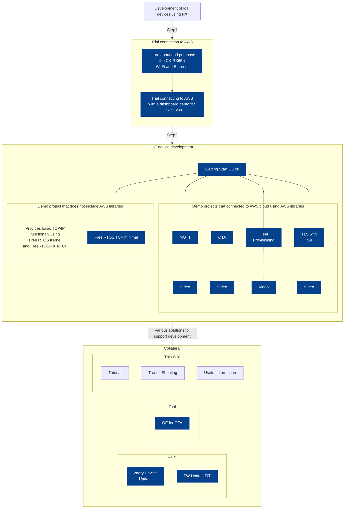

# Welcome to the AWS IoT Reference for Renesas RX MCUs
[English](../ja/Home.md)(This page) / [日本語](../ja/Home.md)  
1. [Tutorial](#tutorial)
1. [TroubleShooting](#TroubleShooting)

The Renesas RX family prepares evaluation boards and FreeRTOS projects certified by AWS Partner Device.  
Please refer to the figure below for the various solutions offered by the RX Family in conjunction with the AWS Cloud.

# Reference
* The latest Application Note(APN), seminar and related information : [Renesas Official Web](https://www.renesas.com/products/microcontrollers-microprocessors/rx-32-bit-performance-efficiency-mcus/cloudsolutions)  

# Tutorial
For the latest information on using Free RTOS projects for RX, please refer to the [Getting Start Guide](https://github.com/renesas/iot-reference-rx/blob/main/Getting_Started_Guide.md).  
If you would like to learn more about the various settings in AWS and operating procedures in e² studio, please also check the following tutorials.    
1. [Register device to AWS IoT](Register-device-to-AWS-IoT.md)
1. [Creating and importing a FreeRTOS project](Creating-and-importing-a-FreeRTOS-project.md)  
 [Importing a FreeRTOS project(zip)](Creating-and-importing-a-FreeRTOS-project.md#importing-a-freertos-project)  
 [Create a new FreeRTOS project](Creating-and-importing-a-FreeRTOS-project.md#create-a-new-freertos-project) 
1. [Configure the FreeRTOS project to connect to AWS IoT Core](Configure-the-FreeRTOS-project-to-connect-to-AWS-IoT-Core.md) 
1. [Execute Amazon FreeRTOS project and connect RX devices to AWS IoT](Execute-Amazon-FreeRTOS-project-and-connect-RX-devices-to-AWS-IoT.md)

# TroubleShooting
Please refer to the [TroubleShooting](https://github.com/renesas/iot-reference-rx/blob/main/Getting_Started_Guide.md#troubleshooting).

# FreeRTOS Related External Links(aws.com)
1. [Amazon FreeRTOS](https://aws.amazon.com/freertos/)
1. [Getting Started with FreeRTOS](https://docs.aws.amazon.com/freertos/latest/userguide/freertos-getting-started.html)
1. [Amazon FreeRTOS Documents](https://docs.aws.amazon.com/freertos/)
	1. [Amazon FreeRTOS UserGuide](https://docs.aws.amazon.com/freertos/latest/userguide/index.html)
	1. [Amazon FreeRTOS API Reference](https://docs.aws.amazon.com/freertos/latest/lib-ref/index.html)
	1. [FreeRTOS kernel fundamentals](https://docs.aws.amazon.com/freertos/latest/userguide/dev-guide-freertos-kernel.html)
