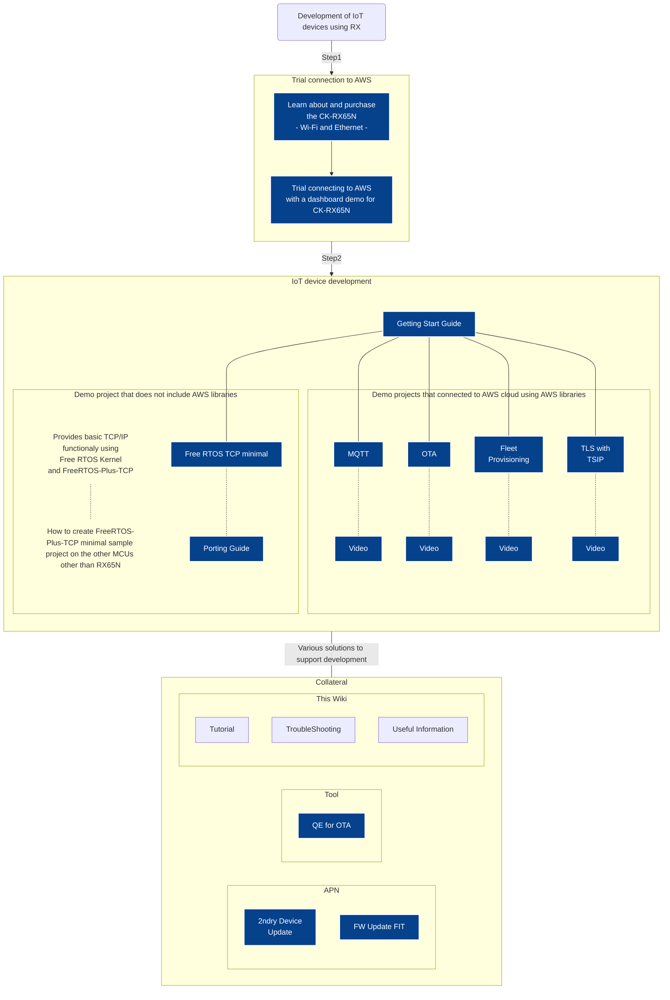

# Welcome to the AWS IoT Reference for Renesas RX MCUs
[English](../en/Home.md) / [日本語(本ページ)](Home.md)  
1. [チュートリアル](#チュートリアル)
1. [トラブルシューティング](#トラブルシューティング)

## はじめに
RXファミリでは、AWSデバイス認定を取得した評価キットおよびFree RTOSプロジェクトで、IoT機器開発をサポートいたします。  
RXファミリが提供するAWSクラウドと連携した各種ソリューションは、以下の図を参照ください。  

## 最新情報
  最新のAPN・セミナ情報は、[＜Renesas公式ページ＞](https://www.renesas.com/jp/ja/products/microcontrollers-microprocessors/rx-32-bit-performance-efficiency-mcus/cloudsolutions)をご参照ください  

## チュートリアル
MQTT通信やOTA、Fleet Provisioning機能を搭載したデモプロジェクトに関する最新の使用方法は、[Getting Start Guide](https://github.com/renesas/iot-reference-rx/blob/main/Getting_Started_Guide.md)を参照ください。  
AWSでの各種設定方法や、e² studioでの操作手順などの詳細を確認したい場合は、以下のチュートリアルも併せてご確認ください。  
1. [デバイスをAWS-IoTに登録する](デバイスをAWS-IoTに登録する.md)
1. [FreeRTOSプロジェクトの入手](FreeRTOSプロジェクトの新規作成・インポート.md)  
 [FreeRTOSプロジェクトをインポートする(zip)](FreeRTOSプロジェクトの新規作成・インポート.md#freertosプロジェクトのインポート)  
 [FreeRTOSプロジェクトをe2studioで新規作成する](FreeRTOSプロジェクトの新規作成・インポート.md#freertosプロジェクトの新規作成) 
1. [FreeRTOSプロジェクトでAWS IoT Coreへの接続に必要な設定を行う](FreeRTOSプロジェクトでAWS-IoT-Coreへの接続に必要な設定.md) 
1. [Amazon FreeRTOSを実行し、RXデバイスをAWS IoTに接続する](FreeRTOSプログラムを実行し、AWS-IoTに接続する.md)

## トラブルシューティング
[トラブルシューティング](トラブルシューティング.md)ページをご確認ください。

## FreeRTOS 関連外部リンク集
1. [Amazon FreeRTOS](https://aws.amazon.com/freertos/)
1. [Amazon FreeRTOS の使用開始](https://docs.aws.amazon.com/freertos/latest/userguide/freertos-getting-started.html)
1. [Amazon FreeRTOS ドキュメント](https://docs.aws.amazon.com/freertos/)
	1. [Amazon FreeRTOS ユーザーガイド](https://docs.aws.amazon.com/freertos/latest/userguide/index.html)
	1. [Amazon FreeRTOS API リファレンス](https://docs.aws.amazon.com/freertos/latest/lib-ref/index.html)
	1. [FreeRTOS カーネルの基礎](https://docs.aws.amazon.com/ja_jp/freertos/latest/userguide/dev-guide-freertos-kernel.html)
## リアルタイムOS解説動画
1. [RTOSチュートリアル（1/7）：なぜRTOSは必要なのか](https://www.youtube.com/watch?v=1emOuolz4ZA)
2. [RTOSチュートリアル（2/7）：タスク](https://www.youtube.com/watch?v=GIw7vFGxAb4)
3. [RTOSチュートリアル（3/7）：ハンドラ](https://www.youtube.com/watch?v=FuYVv410cvo&t=788s)
4. [RTOSチュートリアル（4/7）：システムコール その1](https://www.youtube.com/watch?v=9DlphuPJmv8&t=40s)
5. [RTOSチュートリアル（5/7）：システムコール その2](https://www.youtube.com/watch?v=G9IiFfhLxG4&t=10s)
6. [RTOSチュートリアル（6/7）：構造と性能](https://www.youtube.com/watch?v=Xo4kfilMs_g)
7. [RTOSチュートリアル（7/7）：マルチコアとRTOS](https://www.youtube.com/watch?v=DBa25wjrVoo)
