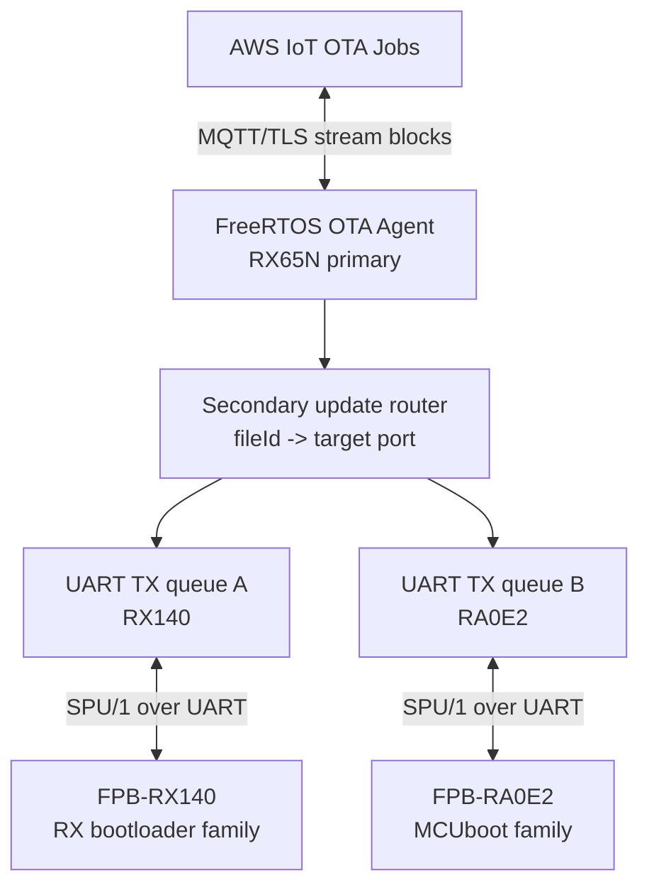

# Secondary Processor Update Plan

Date: 2026-05-31

本メモは `renesas/iot-reference-rx` にセカンダリ MCU アップデート機構を
追加するための初期計画である。まずは調査情報の置き場として作成し、実装が
進むたびにプロトコル仕様、ボード配線、ブートローダ制約、検証結果を追記する。

想定する実装例:

```text
AWS IoT OTA
  -> CK-RX65N / RX65N primary MCU
  -> SCI UART channel A -> FPB-RX140 / RX140 secondary MCU
  -> SCI UART channel B -> FPB-RA0E2 / RA0E2 secondary MCU
```

外部ナレッジベースからのリンク候補:

```md
- [CK-RX65N secondary processor update plan](https://gitlab.saffti.jp/oss/import/github/renesas/iot-reference-rx/-/blob/main/docs/secondary-processor-update.md)
```

リンク追加先の想定:

https://gitlab.saffti.jp/oss/experiment/embedded/mcu/elemental/ota/-/blob/main/CLAUDE.md

## 目的

- AWS 接続を持つ CK-RX65N を primary MCU として使う。
- インターネット接続を持たない複数の secondary MCU を UART 経由で更新する。
- 最初の OSS 実装例は RX65N -> RX140 とする。
- 同じ枠組みで RX65N -> RA0E2 も扱える設計にする。
- AT コマンド風に人間が読める制御層を持ちつつ、ファームウェア本体は
  Base64 ではなくバイナリで転送する。
- RX65N 側の AWS OTA 受信、UART 転送、状態監視は非同期に進める。
- RX140 / RA0E2 のように flash BGO を使えない secondary MCU では、
  `UART受信 -> RAM上のフラッシュ書き換え -> UART受信再開` のループを
  プロトコル上の backpressure として扱う。

初期段階では、ブートローダ形式そのものの再設計、ワイヤレス secondary link、
最大スループット最適化は対象外とする。まず「安全に送れる」「失敗を検出できる」
「ターゲットが増えても破綻しない」を優先する。

## 参照情報の要点

AWS の secondary processor OTA ブログでは、OTA job の `fileId` を使って
更新対象が primary MCU か secondary processor かを識別する。FreeRTOS OTA の
PAL callback を差し替えることで、primary MCU 用の firmware は従来の PAL に
流し、secondary processor 用の firmware block はローカルの serial interface
へ転送できる。AWS コンソールから作成した OTA job は `fileId = 0` になるため、
secondary 用には 0 以外を使う必要がある。

外部の OTA ナレッジベース `CLAUDE.md` には、primary MCU が AWS IoT に
MQTT/TLS で接続し、OTA Jobs を受け、SCI/SPI/I2C などで secondary MCU へ
転送するという 2nd MCU OTA の大枠が既に整理されている。また、primary PAL と
secondary PAL を分ける dual-PAL approach も記載されている。

RX bootloader submodule は、RX ファミリ共通の secure bootloader core として
説明されており、ECDSA P-256 + SHA-256 署名検証、dual-bank code flash の
bank-swap、`r_flash_rx` / `r_sci_rx` などの FIT 依存、`mot_to_rsu.py` による
MOT/RSU 生成を前提にしている。

MCUboot serial recovery と Zephyr MCUmgr/SMP は、今回の protocol の比較対象と
して重要である。image upload/list/reset、progressive erase、fragment、CRC、
複数 transport といった考え方は参考になる。一方で、SMP は CBOR ベースで、
console serial framing は Base64 を使うため、専用 UART で効率を重視する今回の
共通 protocol にはそのまま採用しない方がよい。

## 全体アーキテクチャ



RX65N では AWS OTA agent が cloud interaction の主体であり続ける。その下に
secondary update router を置き、OTA PAL override から受け取った block を
target table に基づいて UART channel へ流す。

初期 target table 案:

| fileId | Target | Board | Link | Image format | Boot path |
|---:|---|---|---|---|---|
| 0 | primary-rx65n | CK-RX65N | internal | existing RX OTA image | existing iot-reference-rx PAL |
| 101 | secondary-rx140 | FPB-RX140 | UART A | RX RSU or agreed RX image package | RX bootloader submodule, RX140 port TBD |
| 102 | secondary-ra0e2 | FPB-RA0E2 | UART B | MCUboot signed image | MCUboot overwrite-only or swap mode TBD |

`fileId` は AWS OTA job 側の routing key とし、log や protocol 上では
`secondary-rx140` のような text target name も併用する。最初は compile-time の
固定 table でよいが、ボード構成が増えたら board config header へ切り出す。

## Protocol 方針

仮称として `SPU/1` (Secondary Processor Update protocol v1) を置く。
狙いは「制御は text」「payload は raw binary」である。すべてを AT command の
text payload にすると大きな firmware で効率が落ち、すべてを opaque binary に
すると bring-up 時の観測性が落ちるため、その中間を取る。

基本形:

```text
SPU/1 <seq> <command> key=value key=value ...\r\n
[optional binary payload of exactly len bytes]
```

応答:

```text
+SPU:<seq>,OK,key=value,key=value\r\n
+SPU:<seq>,ERR,code=<symbol>,detail=<text>\r\n
+SPU:<seq>,PROGRESS,offset=<n>,written=<n>\r\n
```

header に `len=<n>` がある場合、受信側は改行の直後から正確に `n` byte を
binary payload として読む。payload 内の `\r\n` は特別扱いしない。payload を
読み切ったら `crc32` を確認し、line mode に戻る。

最小 command set:

| Command | Direction | Purpose |
|---|---|---|
| `HELLO` | primary -> secondary | protocol negotiation と target identity 取得 |
| `CAPS` | primary -> secondary | payload size、flash granule、flow control、bootloader 能力取得 |
| `PREPARE` | primary -> secondary | image size/hash/version/type を指定して update session 開始 |
| `DATA` | primary -> secondary | firmware chunk を binary payload として送信 |
| `STATUS` | both | offset、flash state、last error を取得または通知 |
| `COMMIT` | primary -> secondary | staged image を bootloader activation 対象にする |
| `VERIFY` | primary -> secondary | staged image の metadata/hash 検証を要求 |
| `RESET` | primary -> secondary | application または bootloader へ reset |
| `ABORT` | primary -> secondary | update session を中断 |

`HELLO` 応答例:

```text
+SPU:1,OK,proto=1,target=secondary-rx140,mcu=rx140,
boot=rx-bootloader,appver=0.1.0,serial=<id>\r\n
```

`CAPS` 応答例:

```text
+SPU:2,OK,max_payload=512,write_granule=8,erase_granule=2048,
rx_buffers=1,flash_async=0,flow=credit,image=rsu\r\n
```

RA0E2 の初期値は、より保守的に始める:

```text
+SPU:2,OK,max_payload=256,write_granule=4,erase_granule=1024,
rx_buffers=1,flash_async=0,flow=credit,image=mcuboot-bin\r\n
```

上記の granule 値は placeholder であり、実装前に各 MCU の manual と
生成された flash driver configuration で確定する。

## Binary Transfer と Flow Control

中核は credit-based flow control とする。secondary MCU は何個の payload buffer を
受け取れるかを `CAPS` または `WINDOW` で primary に伝える。primary は credit の
範囲内で `DATA` を送信し、`OK` / `PROGRESS` / `WINDOW` を受けて次を送る。

RX140 / RA0E2 は初期計画では flash BGO なしとして扱う:

```text
RX65N primary:
  AWS OTA stream block を非同期受信
  target chunk queue に積む
  target credit がある時だけ DATA を送信

RX140 / RA0E2 secondary:
  DATA chunk を RAM buffer に受信
  sequence と CRC を検証
  UART 受信を止める、または credit=0 を通知
  RAM 上の flash erase/write routine を実行
  UART 受信を再開
  written offset と次の credit を返す
```

RTS/CTS が CK-RX65N と FPB 側で無理なく配線できるなら使う。ただし初期配線は
TX/RX/GND だけになる可能性があるため、software credit だけでも成立させる。

初期 payload size 案:

| Target | Initial max payload | Reason |
|---|---:|---|
| RX140 | 512 bytes | RAM buffer と flash staging の負荷を抑える |
| RA0E2 | 256 bytes | 小容量 RAM と MCUboot metadata overhead を考慮 |

payload size、baud rate、AWS OTA block request pacing は実測後に調整する。

## OTA PAL 統合方針

既存 primary OTA PAL の横に secondary PAL path を追加する。

1. OTA job parsing で `fileId = 0` は既存 primary update path へ流す。
2. `fileId != 0` のうち target table にあるものは `secondary_ota_pal` へ流す。
3. `CreateFileForRx` で SPU session を開き、`PREPARE` を送る。
4. `WriteBlock` で OTA block を target UART transfer queue に積む。
5. `CloseFile` で全 chunk の書き込み完了を待ち、`VERIFY` を要求する。
6. `ActivateNewImage` で `COMMIT` と `RESET`、または target 固有 boot flag を使う。
7. `GetPlatformImageState` は、secondary が reset 後に新 version/hash を返してから
   success を返す。

重要点として、AWS OTA agent は PAL から image validity の答えを期待する。
secondary MCU 更新では「UART chunk がすべて ACK された」だけでは AWS job を成功に
してはいけない。primary 側で hash/signature を検証する、secondary bootloader の
検証結果を reset 後に問い合わせる、または両方を行う必要がある。

## Bootloader 方針

### RX140

RX bootloader submodule を baseline とする。既に以下を備える前提になっている:

- ECDSA P-256 + SHA-256 image verification。
- `r_flash_rx` / `r_sci_rx` などの RX FIT 依存。
- `mot_to_rsu.py` による MOT/RSU packaging。
- dual-bank oriented update state machine。

RX140 の初期タスク:

1. RX140 の code flash size、erase block、data flash、RAM、vector layout、
   dual-bank 可否を確認する。
2. memory layout が成立するなら RX bootloader submodule に `config/rx140.h` を追加する。
3. RX140 が既存 RSU container をそのまま受けるか、同じ signing model から派生した
   小さな signed package にするかを決める。
4. `SPU/1` を実装する minimal UART bootloader または application-side receiver を作る。
5. erase/write boundary ごとの電源断、reset、再送を AWS OTA 統合前に試験する。

リスク: 現在の RX bootloader 説明は dual-bank 前提が強い。RX140 の flash 容量や
layout によっては overwrite 型、縮小 slot 型、または別 staging 方針が必要になる。
ここは最初の大きな調査項目である。

### RA0E2

RA0E2 は MCUboot baseline とする。同じ UART protocol で別 bootloader family を
扱えるかを確認するための第2 target として使う。

RA0E2 の初期タスク:

1. RA0E2 の正確な flash size と FSP flash driver configuration を前提に
   MCUboot slot layout を確定する。
2. swap/scratch が厳しい場合は overwrite-only から始める。
3. `SPU/1` が application から secondary slot へ書く方式にするか、MCUboot serial
   recovery に入って adapter layer で転送する方式にするかを決める。
4. 最初は RX140 と共通化しやすい application-side `SPU/1` receiver を優先し、
   native MCUboot serial recovery compatibility mode は後続検討に回す。
5. reset 後、RA0E2 application から image version/hash を取得してから AWS OTA
   success とする。

MCUboot serial recovery は、MCUmgr/SMP の image upload/list/reset を扱え、
設定により upload slot の progressive erase も可能である。初期共通 protocol には
採用しないとしても、RA family 向けの互換 mode として後で評価する価値がある。

## RX65N 側 module 案

実際の source tree が入った段階で調整するが、概念上は以下の分割にする。

```text
Projects/
  aws_demos_ck_rx65n/
    e2studio_ccrx/
      src/
        secondary_update/
          secondary_update_router.c
          secondary_update_router.h
          secondary_update_protocol.c
          secondary_update_protocol.h
          secondary_update_target_table.c
          secondary_update_target_table.h
          secondary_update_uart.c
          secondary_update_uart.h
          secondary_ota_pal.c
          secondary_ota_pal.h
```

protocol encode/decode は `r_sci_rx` から分離し、host PC unit test と SPI/I2C
transport への将来転用をしやすくする。

主要 state:

| State | Meaning |
|---|---|
| `IDLE` | session 未開始 |
| `NEGOTIATING` | `HELLO` / `CAPS` 実行中 |
| `PREPARING` | target erase/layout 準備中 |
| `TRANSFERRING` | AWS blocks を queue し UART chunk を送信中 |
| `DRAINING` | AWS blocks 受信完了、secondary write 完了待ち |
| `VERIFYING` | staged image 検証中 |
| `ACTIVATING` | commit/reset/version check 中 |
| `DONE` | version/hash 確認済み |
| `FAILED` | target または protocol error |

## Reliability Rules

- すべての `DATA` は `session`, `seq`, `offset`, `len`, `crc32` を持つ。
- secondary は最後に ACK した chunk の再送を許容する。
- secondary は異なる `session` の chunk を拒否する。
- primary は reset 後に AWS job を clean failure として報告できるだけの状態を残す。
  primary reset を跨ぐ full resume は後続 milestone とする。
- secondary は bootloader layout が必要とする最小 update control block を不揮発に残す。
- `ABORT` はどの state でも安全に実行できる。
- 予期しない reset 後の default policy は「最後に valid だった application を維持する」。

## Security Rules

- UART CRC は transport integrity であり firmware authenticity ではない。
- RX140 image は RX bootloader signing path、または同等の ECDSA P-256 + SHA-256
  policy で検証する。
- RA0E2 image は MCUboot signed image とし、boot 前に MCUboot で検証する。
- AWS から primary までの OTA signature verification は維持する。
- rollback prevention は target bootloader format と nonvolatile storage が確定してから、
  monotonic version または security counter で設計する。
- primary は target identity、image version、image hash、result status を記録する。

## Milestones

### M0: Documentation And Feasibility

- 本メモを `docs/secondary-processor-update.md` として置く。
- 外部 OTA knowledge base から本メモへのリンクを追加、または追加依頼する。
- CK-RX65N の UART channel と FPB-RX140 / FPB-RA0E2 の connector pin を確認する。
- RX140 / RA0E2 の flash layout 制約を確認する。

### M1: Protocol Prototype On Host

- `SPU/1` encoder/decoder を host-buildable C として実装する。
- command parsing、binary length、CRC、error response、duplicate chunk、credit/window の
  unit test を追加する。
- PC-side fake secondary を作り、hardware 前に transfer log を検証する。

### M2: RX65N Two-UART Skeleton

- UART A/B の target table を追加する。
- 2つの SCI channel を non-blocking TX/RX queue 付きで開く。
- 両 FPB board の simple echo firmware に対して `HELLO`, `CAPS`, `STATUS` を通す。

### M3: RX140 First Update Path

- RX bootloader configuration を RX140 向けに port または adapt する。
- 必要な flash write section を RAM 実行にし、RX140 `SPU/1` receiver を実装する。
- 小さな signed test image を UART 経由で転送して boot する。
- transfer 中、flash write 中、commit 前後の reset injection を行う。

### M4: RA0E2 Second Update Path

- MCUboot layout と minimal RA0E2 application-side receiver を作る。
- 同じ `SPU/1` primary code から MCUboot signed image を転送する。
- reset 後の version/hash 確認をもって success とする。

### M5: AWS OTA Integration

- OTA PAL path に `fileId` routing を追加する。
- 1 OTA job につき 1 secondary target から始める。
- target post-reset confirmation 後にだけ AWS job success を報告する。
- `fileId = 0` の primary RX65N OTA が従来通り動くことを確認する。

### M6: Performance And Expansion

- payload size、UART baud rate、AWS OTA block request pacing を調整する。
- software credit だけで足りない場合は RTS/CTS を追加する。
- UART update time が長すぎる場合、将来 transport として SPI を評価する。
- RA family 向けに optional MCUboot serial recovery compatibility mode を評価する。

## Open Questions

- FPB-RX140 / FPB-RA0E2 に割り当てる CK-RX65N の SCI channel と pin はどれにするか。
- 2 link 分の RTS/CTS を無理なく配線できるか。初期は software credit only でよいか。
- RX140 で dual-bank または staged signed update layout が成立するか。
- RX140 は RSU を直接受けるべきか、RX65N が RSU を unwrap して normalized image package を
  送るべきか。
- RX140 / RA0E2 の update control block はどこに置くか。
- primary は streaming 中に full image hash を計算するべきか。それとも target bootloader
  verification と post-reset query を主にするべきか。
- AWS OTA job metadata で `fileId` 以外に board family、channel、image format、version、
  minimum allowed version をどう表現するか。
- CK-RX65N と FPB board の予定配線で安全な最大 baud rate はどの程度か。

## References

- AWS blog: How to perform secondary processor over-the-air updates with FreeRTOS:
  https://aws.amazon.com/jp/blogs/news/how-to-perform-secondary-processor-over-the-air-updates-with-freertos/
- OTA knowledge base `CLAUDE.md`:
  https://gitlab.saffti.jp/oss/experiment/embedded/mcu/elemental/ota/-/blob/main/CLAUDE.md
- RX bootloader submodule README:
  https://gitlab.saffti.jp/oss/experiment/embedded/mcu/renesas/rx/bootloader/submodule/-/blob/main/README.md
- MCUboot serial recovery:
  https://docs.mcuboot.com/serial_recovery.html
- Zephyr MCUmgr overview:
  https://docs.zephyrproject.org/latest/services/device_mgmt/mcumgr.html
- Zephyr SMP transport specification:
  https://docs.zephyrproject.org/latest/services/device_mgmt/smp_transport.html
- Renesas CK-RX65N:
  https://www.renesas.com/en/design-resources/boards-kits/ck-rx65n
- Renesas FPB-RX140:
  https://www.renesas.com/en/design-resources/boards-kits/fpb-rx140
- Renesas FPB-RA0E2:
  https://www.renesas.com/en/design-resources/boards-kits/fpb-ra0e2
